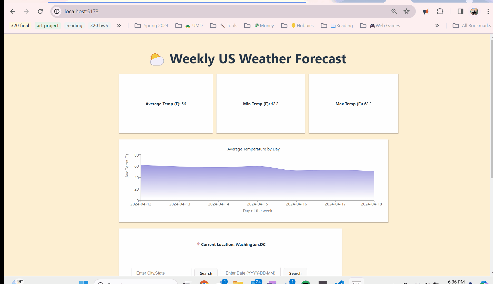

# *US Weather Dashboard*

Submitted by: **Annie Zhou**

This is a weather dashboard that includes a weekly forecast of weather data and visualization and can be customized by city.
This was made using ReactJs and WeatherBit API.

## Required Features

The following **required** functionality is completed:

- [x] **The app includes at least one unique chart developed using the fetched data that tell an interesting story**
- [x] **Clicking on an item in the list view displays more details about it**
- [x] **Clicking on an item has a direct, unique link to that item's detail view page**

## Video Walkthrough

Here's a walkthrough of implemented user stories:

